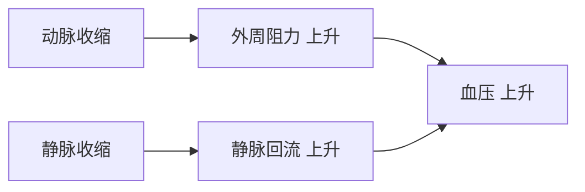

>神经系统对心血管功能的调节, 是通过各种心血管反射实现的。

## 心脏的神经支配
### 心交感神经
- 节前神经元的-**轴突末梢**释放：**乙酰胆碱**(Ach)
	- 乙酰胆碱能激活节后神经元膜上的N型胆碱能受体
	- 使心房肌和心室肌的收缩能力增强。
	
- 节后神经元的-轴突末梢释放：**去甲肾上腺素**(NE) 
	-  作用于$\ce{β1}$ 受体
	- 使膜上的钙通道弹酸化， $\ce{Ca+}$ 内流增多，使心肌收缩力和舒张功能增强

- 普萘洛尔（心得安）等 $\ce{β}$ 受体拮抗剂能**阻断交感神经**对心脏的作用

 **效应**
- 正性变力一心肌收缩力增强
- 正性变时一心率加快
- 正性变传导一传导性增加

### 心迷走神经
- 节后纤维末梢释放的**乙酰胆碱**(Ach)
	- 作用于心肌细胞膜的M型胆碱能受体
- 可导致心率减慢，心房肌收缩能力减弱，心房肌不应期缩短，房室传导速度减慢，即具有负性变时、变力和变传导作用
- **阿托品**可**阻断迷走神经**对心脏的抑制作用。
**效应**：
负性变力—心肌收缩力减弱
负性变时—心率减慢
负性变传导一房室传导速度减慢

|  | 心交感神经 | 心迷走神经 |
| - | - | - |
| 起源 | 脊髓第 $\ce{T1}$ - $\ce{T5}$ 胸段测角神经元 | 延髓的迷走神经背核和疑核 |
| 递质 | **去甲肾上腺素**(NE)  | **乙酰胆碱**(Ach) |
| 受体 | $\ce{β1}$ 受体 | M受体 |
| 阻断剂 | 心得安| 阿托品 |
| 作用 | 使心脏活动增强 | 使心脏活动抑制 |  

- **心迷走神经**和**心交感神经**对心脏的作用是相对抗的，但是当两者同时对心脏发生作用时

## 血管的神经支配

### 交感缩血管神经
- 末梢释放的递质为去**甲肾上腺素**(NE)
	- 与 $\ce{a}$  受体结合, 导致缩血管效应。
	- 缩血管纤维兴奋时引起**缩血管**效应
- **效应**：全身血管收缩

### 交感舒血管神经

- **交感舒血管神经纤维**
	- 分布于骨骼肌的微动脉一使骨骼肌血流量增加
	- 释放Ach,作用于M受体，使骨骼肌血管舒张，血流量增多
	- [阿托品](https://www.yixue.com/%E9%98%BF%E6%89%98%E5%93%81 "阿托品")可阻断其效应
- 生理意义是: 机体剧烈运动时, 为肌肉活动提供更多的血流量, 以满足运动的需要;

- **副交感舒血管神经纤维**
	- 分布于脑、唾液腺、胃肠道、外生殖器一调节局部器官的血流量
	- 释放Ach,作用于M受体，引起血管舒张
- 生理意义：对器官组织局部血流起调节作用

### 心血管中枢
- **延髓心血管中枢**
>延髓是最基本的心血管中枢。 实验表明心血管的紧张性活动起源于延髓

- 心迷走中枢
- 心交感中枢
- 交感缩血管中枢
- 三大中枢经常保持紧张性活动，与各中枢相互配合协调，共同调节心血管活动

-  延髓以上的心血管中枢
	- 在延髓以上的脑干、 下丘脑、 小脑和大脑
	- 起整合作用 
- **下丘脑**：调节心血管活动的整合区, 主要作用在**体温调节**和应急反应

### 心血管反射
- **颈动脉窦、主动脉弓压力感受性反射**(窦-弓反射、减压反射)
- **压力感受器** :颈动脉窦和主动脉弓血管壁外膜下有丰富的感觉神经末梢, 它们能感受动脉血压对血管壁的机器牵张刺激, 称为压力感受器
	- 动脉血压升高时，压力感受器传入神经冲动增多。
- **压力感受性反射**：动脉血压变化时通过压力感受性反射活动使血压维持相对稳定的过程称为压力感受性反射

- **减压反射**：
- 是颈动脉窦和[主动脉弓](https://baike.baidu.com/item/%E4%B8%BB%E5%8A%A8%E8%84%89%E5%BC%93/7394226?fromModule=lemma_inlink)压力感受器兴奋发放神经冲动，分别沿窦神经和主动脉神经传至[延髓心血管中枢](https://baike.baidu.com/item/%E5%BB%B6%E9%AB%93%E5%BF%83%E8%A1%80%E7%AE%A1%E4%B8%AD%E6%9E%A2/4094845?fromModule=lemma_inlink)，使心[迷走紧张](https://baike.baidu.com/item/%E8%BF%B7%E8%B5%B0%E7%B4%A7%E5%BC%A0/0?fromModule=lemma_inlink)加强，而交感紧张和缩血管紧张减弱，其效应是心率减慢，血管舒张，外周阻力减小，从而使[血压](https://baike.baidu.com/item/%E8%A1%80%E5%8E%8B/766186?fromModule=lemma_inlink)降低，故又称减压反射；主动脉神经又称[减压神经](https://baike.baidu.com/item/%E5%87%8F%E5%8E%8B%E7%A5%9E%E7%BB%8F/7837983?fromModule=lemma_inlink)。
- 减压反射是一种[负反馈调节](https://baike.baidu.com/item/%E8%B4%9F%E5%8F%8D%E9%A6%88%E8%B0%83%E8%8A%82/9631668?fromModule=lemma_inlink)机制，**意义是**维持动脉血压的相对稳定

- **窦-弓反射**
- 当血压升高时,窦-弓反射快速调节,使血压降低,维持血压稳定。
- 减压反射是一种可以**降低血压**的自主调节机制

- 压力感受器对生理情况下突发性动脉血压变化最敏感, 而对持续性的血压变化逐渐失去敏感性。 
- 因此, **高血压的患者无法通过减压反射使血压恢复到正常水平**
